########################## DOCUMENTATION SWAGGER ########################

Login : 

Authorization Bearer Token:

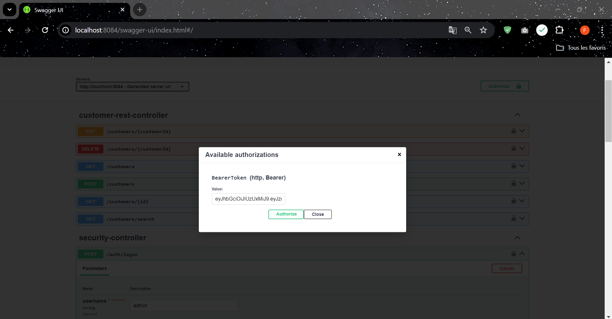

Profile :

Customers :

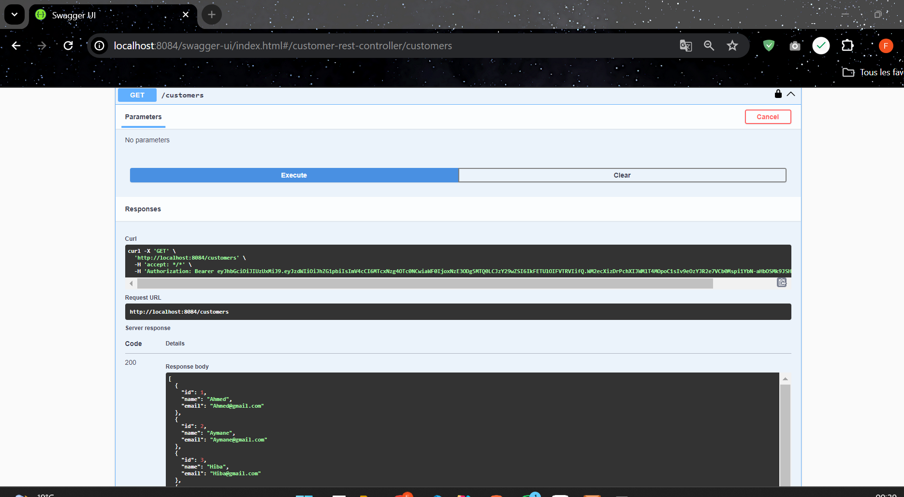

Save Customer :

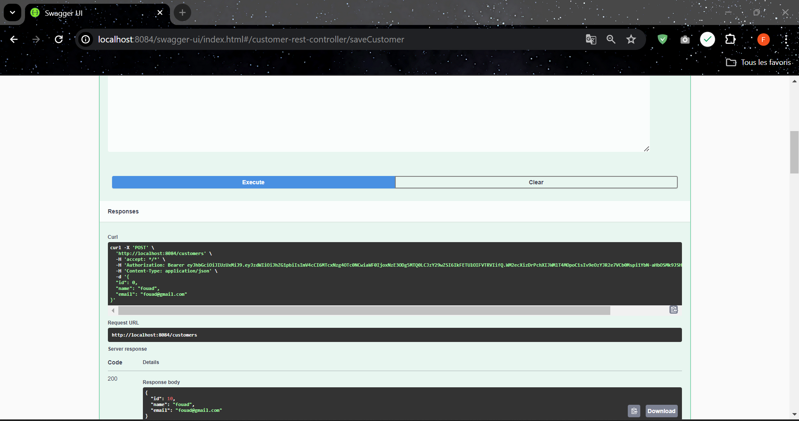

Find Customer :

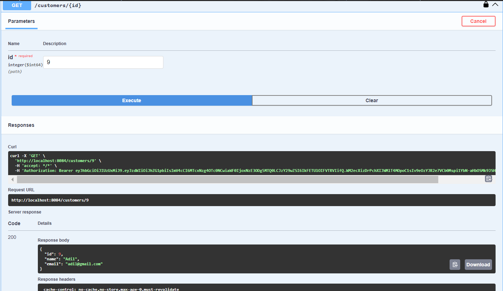

Edit Customer :

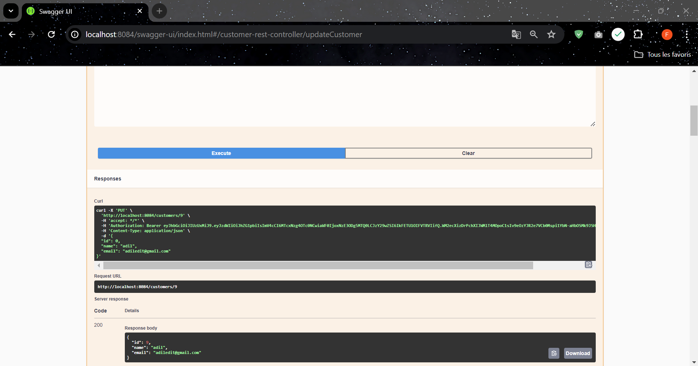

Delete Customer :

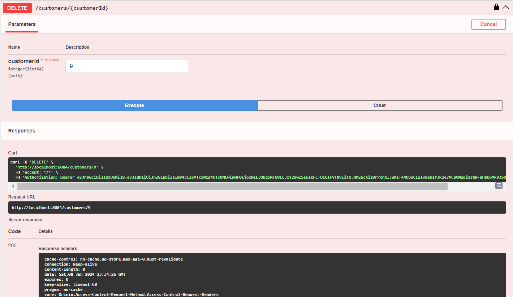

Bank Account List : 

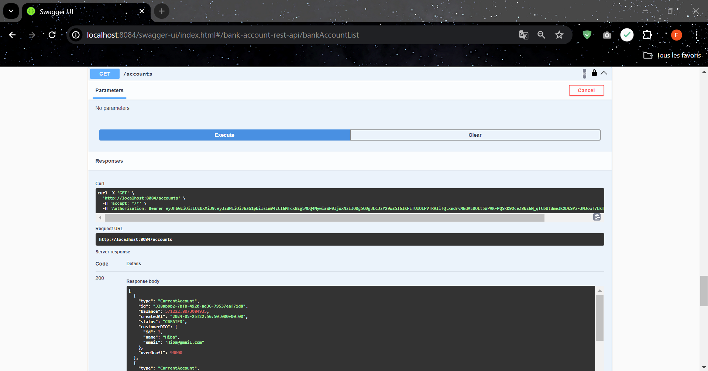

Find Bank Account By id :

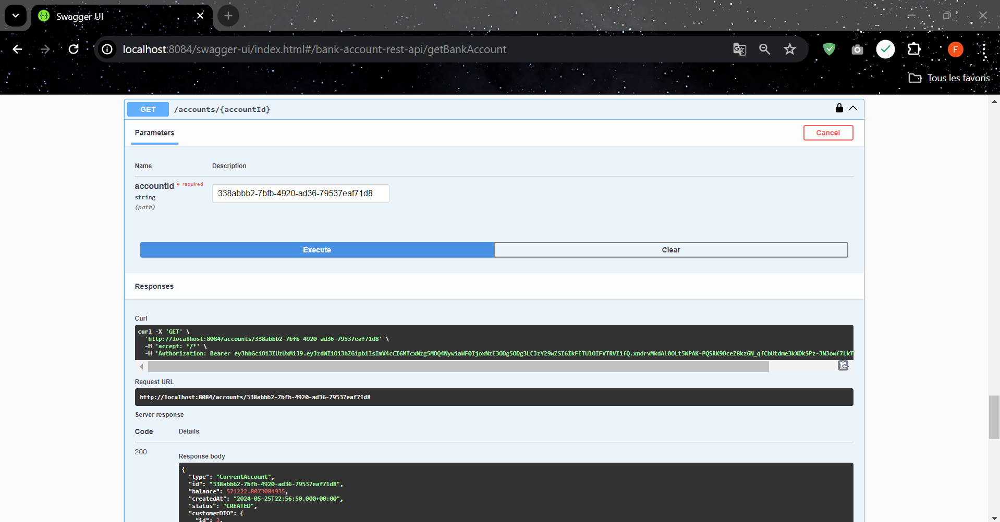

Operations of account :

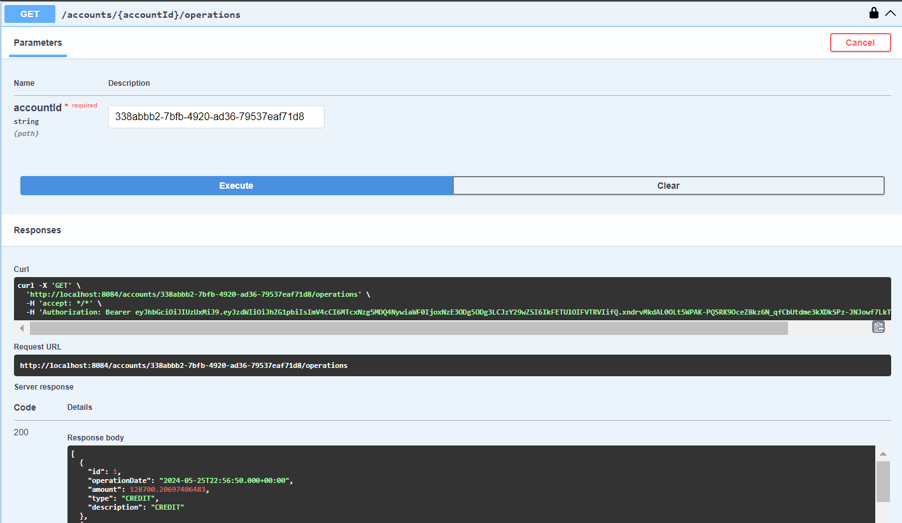

Operations with paginations 1 :

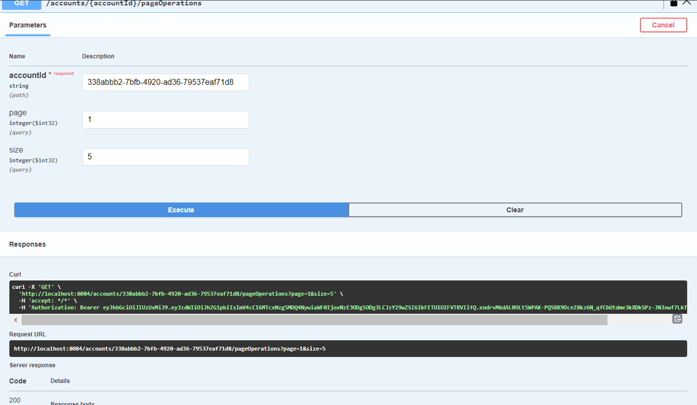

Operations with paginations 2 :

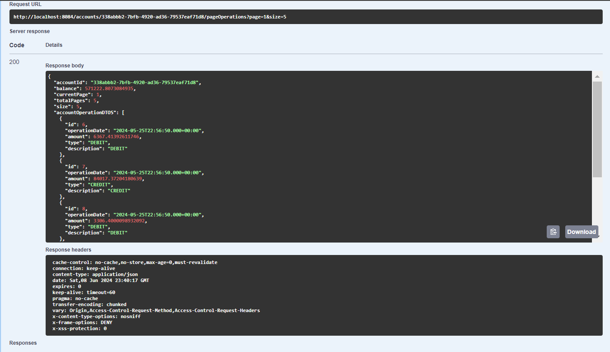

Credit account 1 :

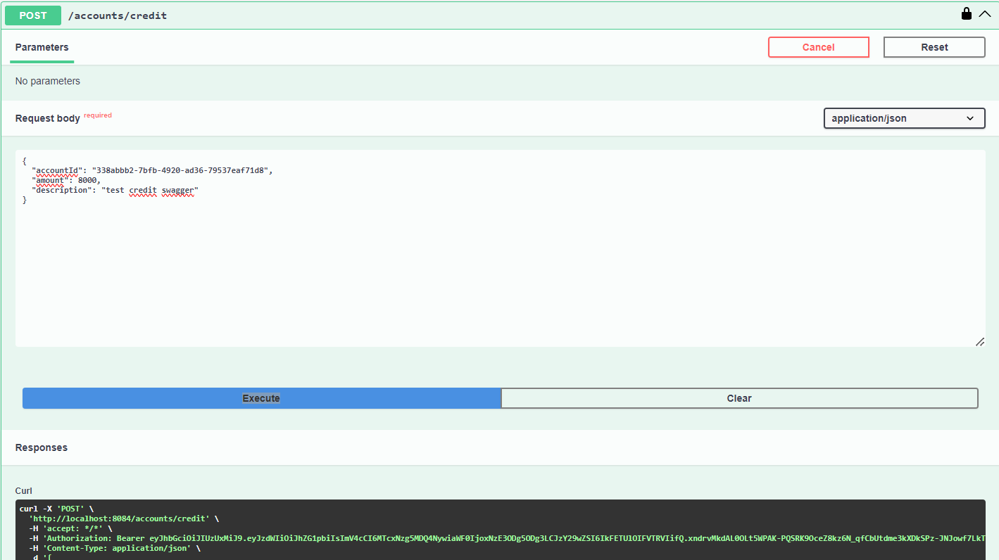

Credit account 2 :

Debit account 1 :

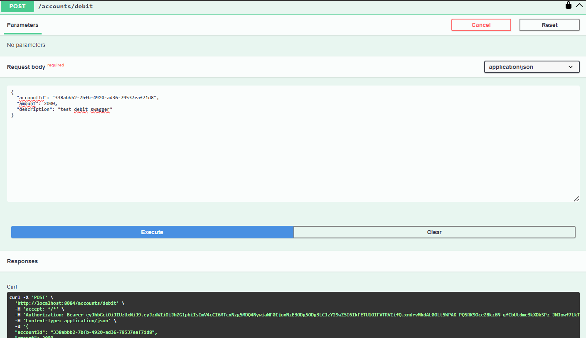

Debit account 2 :

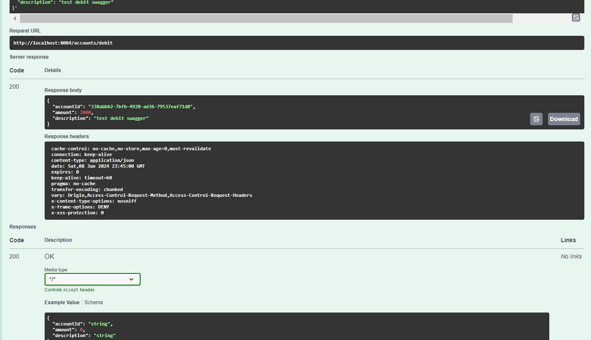

Transfer from account to another account 1 :

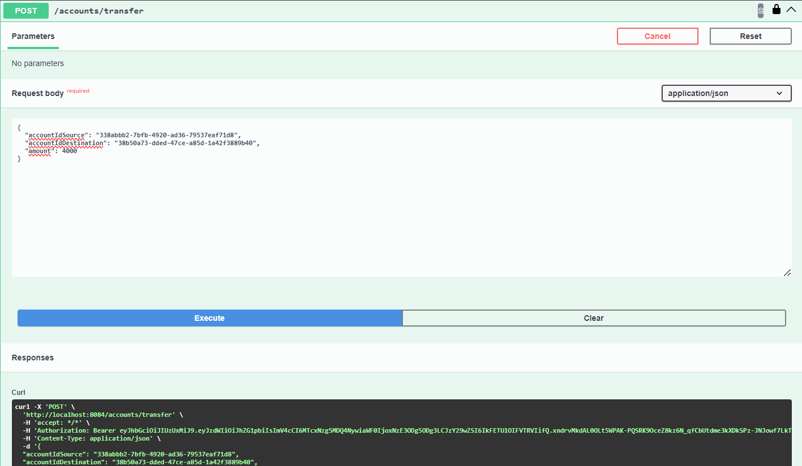

Transfer from account to another account 2 :

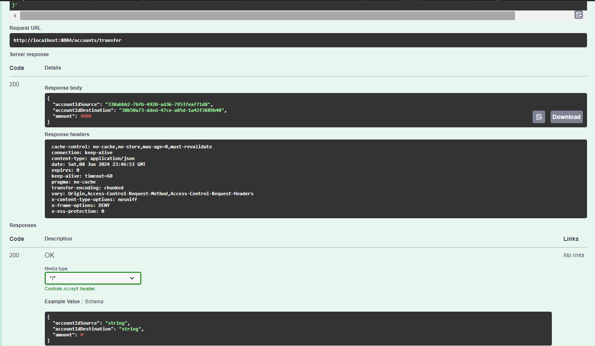

############################# INTERFACES #########################

