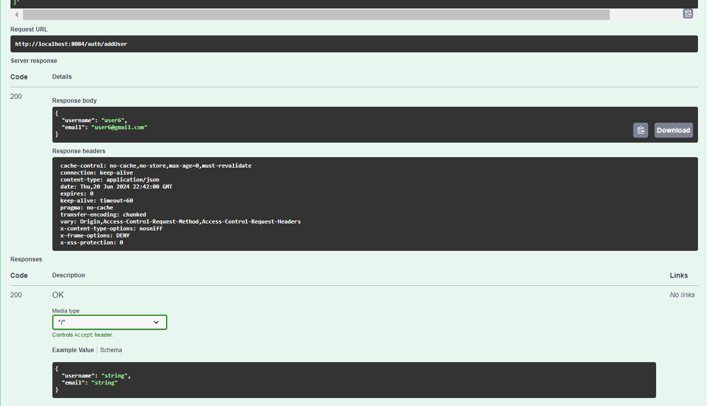
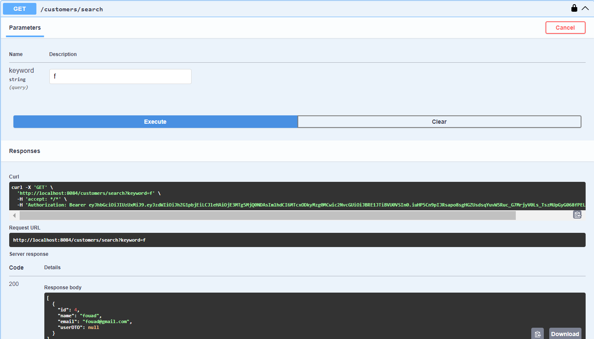
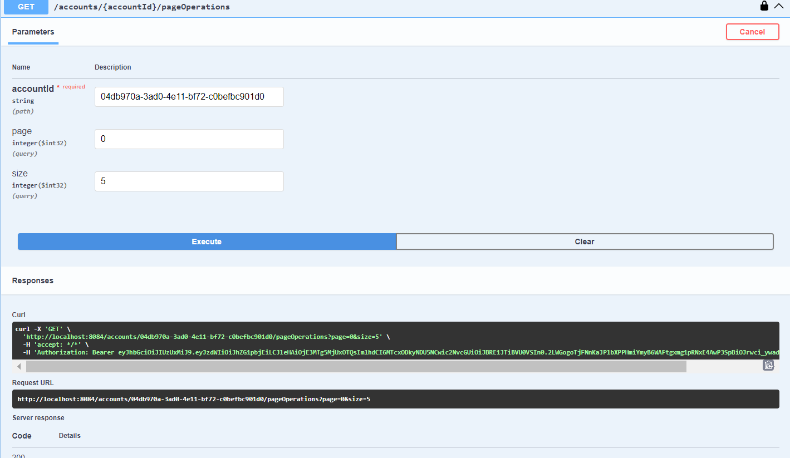
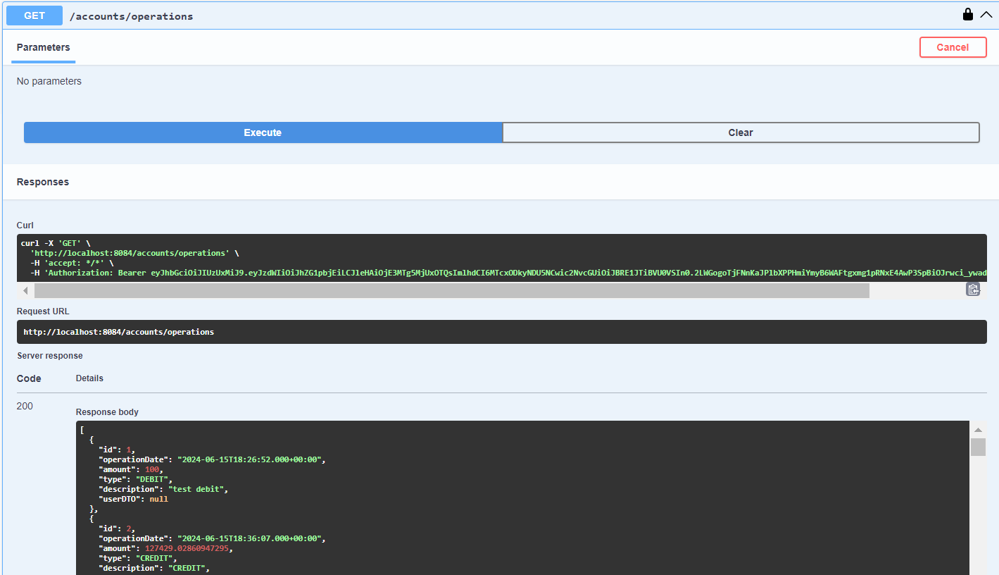

# Digital banking backend

## Swagger Documentation

### USERS ======>>>>>

#### Login:

#### Authorized Token :

#### Profile Details :

#### Add New User :

#### Get All Users:

#### Edit Password :

#### Add Role To User :

#### Get Roles of User :

#### Delete Role of user :

#### Add New Role :

#### Get All Roles :

#### Delete Role :

### Customers =====>>>>

#### Get All Customers:

#### Get Customers by search:

#### Get All Customers by search and pagination:

#### Get Customer by ID:

#### Add New Customer:

#### Edit Customer:

#### Delete Customer:

### Accounts ====>>>>>

#### Get All Accounts :

#### Get Account By ID :

#### Get Account By Customer :

#### Get Operations Of Account with pagination :

#### Get Operations Of Account without pagination : 

#### Get All Operations :

#### Credit Account :

#### Debit Account :

#### Transfer to another account :

### Save CurrentAccount :

### Save SavingAccount :

### Get Accounts By customer with pagination :

