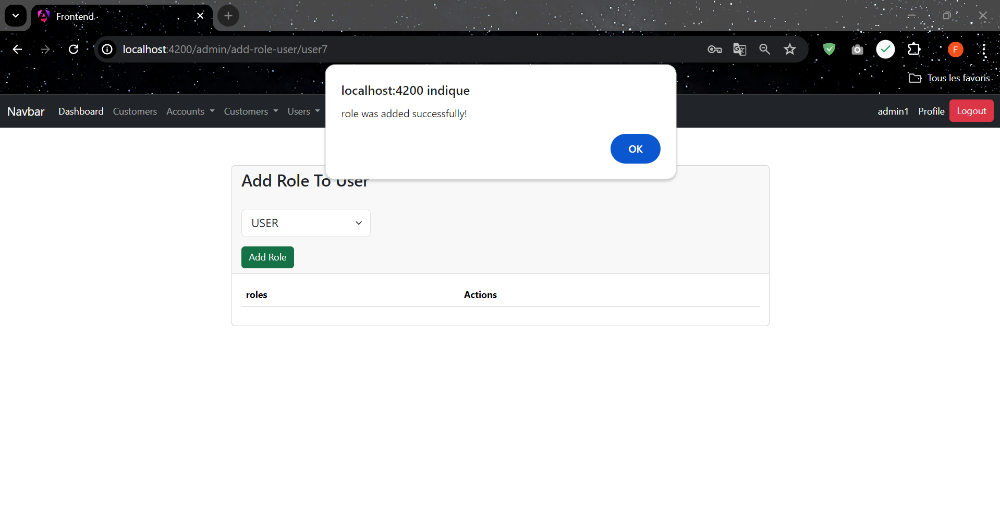
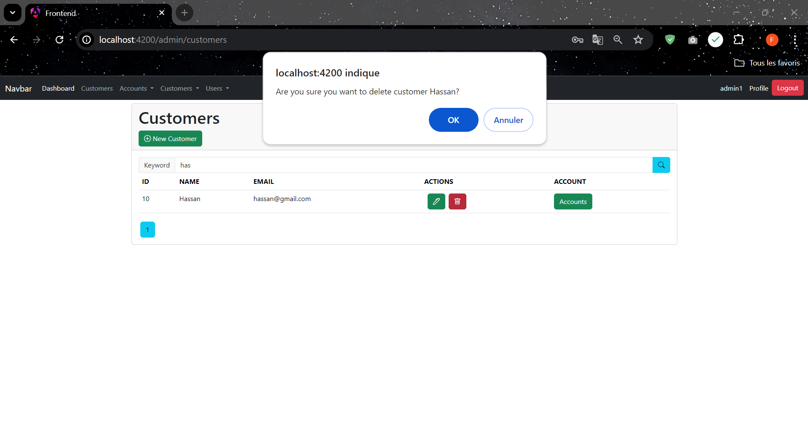

# Digital banking frontend

## Interfaces Documentation

### USERS ======>>>>>

#### Login :

#### Incorrect Authentication :

#### User Logged :

### Edit Password :

### Save User :

### Users :

### Add Role To User :

### Remove Role From User : 

### Save Role : 

## Customers ====>>>>

* **_INTERFACES WHEN ADMIN LOGGED_**

### Customers :

### Add New Customer :

### Customers search :

### Edit Customer :

### After Edit Customer :

### Delete Customer :

### Accounts of Customer :

* **_INTERFACES WHEN USER LOGGED_**
### Customers :

## Accounts ====>>>>>

* **_INTERFACES WHEN ADMIN LOGGED_** 

### Accounts :

### Accounts by customer with pagination:

### Before Save Account :

### Save Saving Account :

### Save Current Account :

### Display Operations :

### Save Debit Operation :

### Save Credit Operation :

### Save Transfer Operation :

### After Transfer (credit and debit) :

* **_INTERFACES WHEN USER LOGGED_**
### Operations :

### Pie Charts of Operations Type and Accounts Type :

### Bar Chart Accounts of Customers :

### Line Chart Operations By Date :

### Bar Chart Operations By Date (Total Amount Debit) :

### Bar Chart Operations By Date (Total Amount Credit) :

### Accounts :

### Customers :

